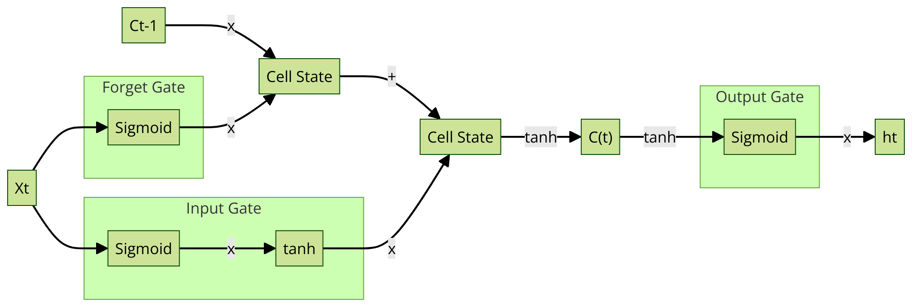

ZenML IMDB LSTM
===============

Small production-minded ZenML pipeline for training an LSTM on IMDB.

How to run:
1. pip install -r requirements.txt
2. zenml init
3. (optional) start mlflow server locally
4. python2 src/run_pipeline.py

