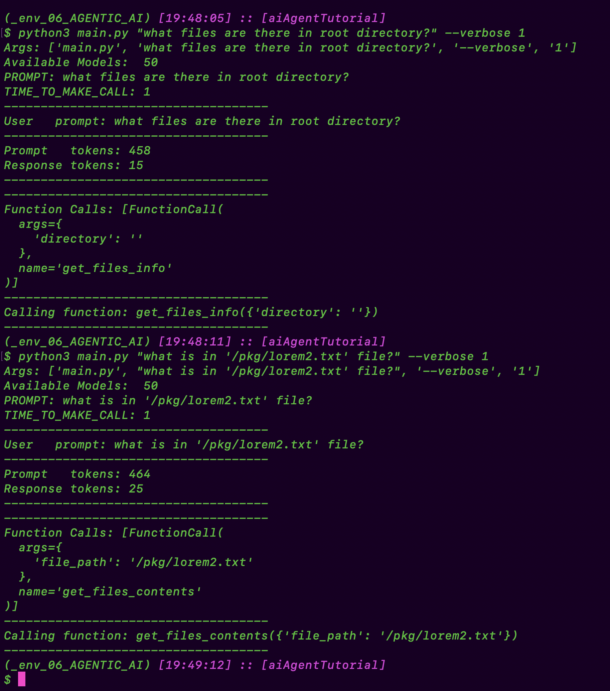
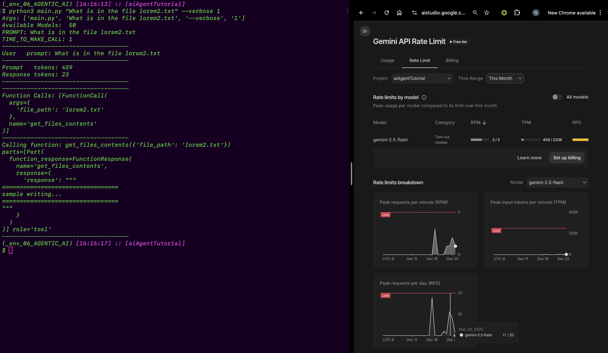
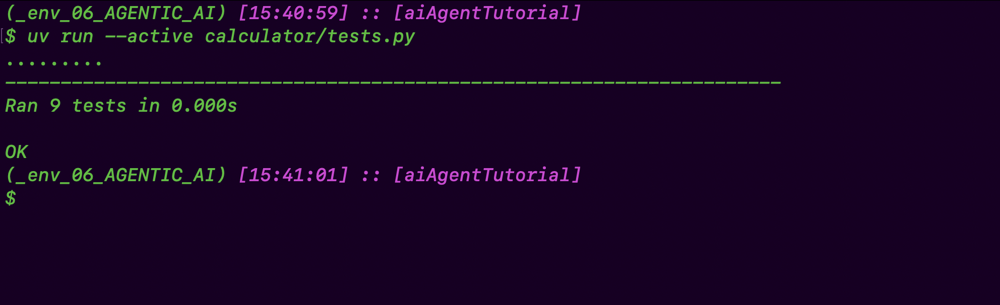
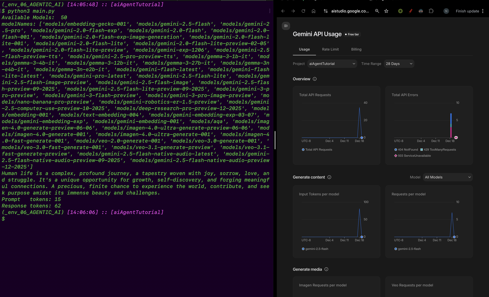

# AI Agents

A Python tutorial project demonstrating how to build an AI agent using Google's Gemini API. This project showcases how an AI agent can interact with the file system through custom tools/functions, enabling it to read, write, and explore files autonomously.

## Overview

This project implements an AI agent that can:

- **Self-prompt** and make decisions in a loop
- **Use tools** to interact with the file system
- **Read files** and directory contents
- **Write files** within a controlled working directory
- **Execute Python files** with arguments
- **Execute tasks** autonomously based on user instructions

## Features

### Core Functions

The agent has access to four main tools, which are dispatched through the `call_function.py` module:

1. **`get_files_info`** - Lists files and directories in a specified path

   - Returns file names, directory flags, and file sizes
   - Validates paths to ensure they're within the working directory

2. **`get_files_contents`** - Reads file contents

   - Supports reading files up to 1000 characters
   - Automatically truncates larger files with a notification
   - Validates file paths for security

3. **`write_file`** - Writes content to files

   - Creates parent directories if they don't exist
   - Validates paths to prevent directory traversal attacks
   - Returns success/error messages

4. **`run_python_file`** - Executes Python files
   - Runs Python scripts within the working directory
   - Supports command-line arguments
   - Returns stdout, stderr, and exit codes
   - Includes timeout protection (30 seconds)
   - Validates file paths and ensures files are Python scripts

### Calculator Example

The project includes a calculator application in the `calculator/` directory that demonstrates:

- Expression evaluation with operator precedence
- JSON-formatted output
- Error handling for invalid expressions

## Prerequisites

- Python 3.13 or higher
- Google Gemini API key
- `python-dotenv` package (for environment variable management)
- `google-genai` package (Google's Gemini API client)

## Installation

1. Clone or navigate to the project directory:

```bash
cd 06_AGENTIC_AI/aiAgentTutorial
```

2. Install dependencies (if using uv):

```bash
uv sync
```

Or install manually:

```bash
pip install python-dotenv google-genai
```

3. Create a `.env` file in the project root:

```env
API_KEY=your_gemini_api_key_here
```

## Usage

### Running the Main Agent

The main agent script accepts command-line arguments:

```bash
python main.py "<your_prompt>" [--verbose] [1]
```

**Arguments:**

- `prompt` (required): The instruction or question for the AI agent
- `--verbose` (optional): Show detailed token usage information and full function arguments
- `1` (optional): Set to `1` to actually make the API call (default: skip call to save API usage during testing)

**Examples:**

```bash
# Basic usage (skips API call by default)
python main.py "List all files in the calculator directory"

# Make actual API call with verbose output
python main.py "Read the contents of lorem.txt" --verbose 1

# Make API call without verbose output
python main.py "What files are in the project?" "" 1

# Skip API call (for testing)
python main.py "What files are in the project?" --verbose
```

**Note:** When the agent makes function calls, you'll see output like:
```
Function Calls: [...]
Calling function: get_files_info({'directory': 'calculator'})
```

Or with verbose mode disabled:
```
Function Calls: [...]
 - Calling function: get_files_info
```

This shows which tools the agent decided to use and with what arguments. The verbose flag controls whether function arguments are displayed.

### Example Output

Here's an example of successful tool calling by Gemini:



The image above demonstrates the agent successfully:
- Receiving a user prompt
- Making autonomous decisions to call appropriate tools
- Displaying function call information
- Executing file system operations

Here's an example of the function execution output after integration with Gemini:



This image shows the actual output from `call_function` after it executes the requested operations, displaying the results returned to the Gemini API for further processing.

### Running the Calculator

The calculator example can be run independently:

```bash
cd calculator
python main.py "3 + 5 * 2"
```

## Project Structure

```
aiAgentTutorial/
├── main.py                 # Main agent script with API integration
├── call_function.py        # Function dispatcher for executing agent tools
├── functions/              # Agent tools/functions
│   ├── get_files_info.py  # List directory contents + schema
│   ├── get_files_contents.py  # Read file contents + schema
│   ├── write_file.py      # Write files + schema
│   └── run_python_file.py # Execute Python files + schema
├── calculator/            # Example calculator application
│   ├── main.py
│   ├── pkg/
│   │   ├── calculator.py  # Calculator logic
│   │   └── render.py      # Output formatting
│   └── tests.py          # Calculator tests
├── tests.py              # Unit tests for agent functions
├── pyproject.toml        # Project configuration
├── uv.lock               # Dependency lock file (if using uv)
└── readme/               # Documentation
    └── README.md         # This file
```

**Note:** Each function in the `functions/` directory exports both:
- The actual function implementation (e.g., `get_files_info()`)
- A schema declaration (e.g., `schema_get_files_info`) for API registration

The `call_function.py` module acts as a dispatcher that:
- Receives function call requests from the Gemini API
- Routes calls to the appropriate function implementation
- Wraps responses in the proper `types.Content` format for the API
- Handles errors and unknown function calls gracefully

## Testing

Run the test suite to verify all functions work correctly:

```bash
python tests.py
python3 main.py "[PROMPT HERE]" --verbose 1/0
```



The tests cover:

- `TestGetFilesInfo`: Directory listing functionality
- `TestGetFilesContents`: File reading functionality
- `TestWriteFile`: File writing functionality
- `TestRunPythonFile`: Python file execution functionality

## Architecture

The agent is built using Google's Gemini API with function calling capabilities:

- **Function Schemas**: Each tool function exports a `FunctionDeclaration` schema that defines its interface
- **Tool Registration**: Schemas are collected into a `types.Tool` object and passed to the API via `GenerateContentConfig`
- **System Instructions**: The agent receives a system prompt that guides its behavior and capabilities
- **Thinking Config**: The agent uses `ThinkingConfig` with `include_thoughts=False` to control internal reasoning display
- **Function Calling**: The API can autonomously decide to call functions based on the user's prompt
- **Function Dispatcher**: The `call_function.py` module handles routing function calls to the appropriate implementation
- **Response Handling**: The code checks for `function_calls` in the response and displays them, or shows the text response

This architecture allows the agent to autonomously decide when and how to use tools without explicit instructions.

## Security Features

The agent functions include security measures:

- **Path validation**: All file operations are restricted to the working directory
- **Directory traversal prevention**: Prevents access to files outside the working directory
- **File size limits**: File reading is limited to 1000 characters to prevent memory issues
- **Execution timeout**: Python file execution is limited to 30 seconds to prevent infinite loops
- **File type validation**: Only Python files can be executed via run_python_file

## How It Works

1. **Agent Initialization**: The main script connects to Google's Gemini API using your API key and loads available models

   When the agent starts, it lists all available models from the Gemini API:

   

   This shows the number of models available and allows you to see which models you can use with the API.

2. **System Prompt**: The agent is configured with a system instruction that explains its capabilities:
   - List files and directories
   - Read file contents
   - Write to files (create or update)
   - Run Python files with optional arguments
3. **Tool Registration**: The agent has access to four file system tools registered via `FunctionDeclaration` schemas:
   - `get_files_info` - Lists directory contents
   - `get_files_contents` - Reads file contents
   - `write_file` - Writes to files
   - `run_python_file` - Executes Python scripts
4. **Autonomous Execution**: When you provide a prompt, the agent:
   - Analyzes your request
   - Decides which tools (if any) to use
   - Makes function calls automatically
   - Displays function call information including function name and arguments (full arguments shown only in verbose mode)
5. **Function Execution**: The `call_function.py` module:
   - Routes function calls to the appropriate implementation
   - Executes functions within the working directory context
   - Returns formatted responses wrapped in `types.Content` objects
   - Handles unknown functions gracefully with error messages
6. **Response Handling**: The agent can return:
   - Text responses for general queries
   - Function call information when tools are used
   - Verbose token usage statistics (when `--verbose` flag is used)
   - Function execution results wrapped in tool response format

## Configuration

### Model Selection

The agent uses the `gemini-2.5-flash` model by default. You can modify the model in `main.py`:

```python
response = client.models.generate_content(
    model="gemini-2.5-flash",  # Change this to use a different model
    contents=prompt,
    config=config,
)
```

The agent automatically lists all available models when it starts, showing the total count of available models from your Gemini API account.

### System Prompt

The agent's behavior is guided by a system prompt that defines its capabilities. You can customize the `systemPrompt` variable in `main.py` to change how the agent interprets and responds to requests:

```python
systemPrompt: str = """
You are a helpful AI coding agent.

When a user asks a question or makes a request, make a function call plan. You can perform the following operations if needed:

- list files and directories
- Read the content of a file
- write to a file (create or update)
- Run a Python file with optional arguments

All paths you provide should be relative to the working directory. You don't need to provide working directory in the function call, as it is ingested automatically for security purposes.
"""
```

### Working Directory

The agent operates within a controlled working directory (set to `"calculator"` by default in `call_function.py`). All file operations are restricted to this directory for security. You can modify the `workingDirectory` variable in `call_function.py` to change the working directory:

```python
workingDirectory: str = "calculator"  # Change this to use a different working directory
```

### Function Schemas

Each function module exports a schema (e.g., `schema_get_files_info`) that defines the function's interface for the Gemini API. These schemas use `types.FunctionDeclaration` to specify:
- Function name
- Description
- Parameters and their types
- Required parameters

The schemas are automatically registered with the agent via the `availableFunctions` tool configuration.

## Error Handling

The project includes comprehensive error handling:

- **File Operations**: Invalid file paths, missing directories, file read/write errors
- **API Operations**: Connection issues, malformed responses, missing usage metadata
- **Function Execution**: Timeout errors, invalid Python files, execution exceptions
- **Path Security**: Directory traversal attempts are blocked with error messages
- **Unknown Functions**: If an unrecognized function is called, the agent returns an error message indicating the function is unknown

When errors occur, the agent will display appropriate error messages, and function calls will return error information that the agent can use to adjust its approach. Error messages are formatted and returned as part of the function response, allowing the agent to handle them gracefully in subsequent interactions.
